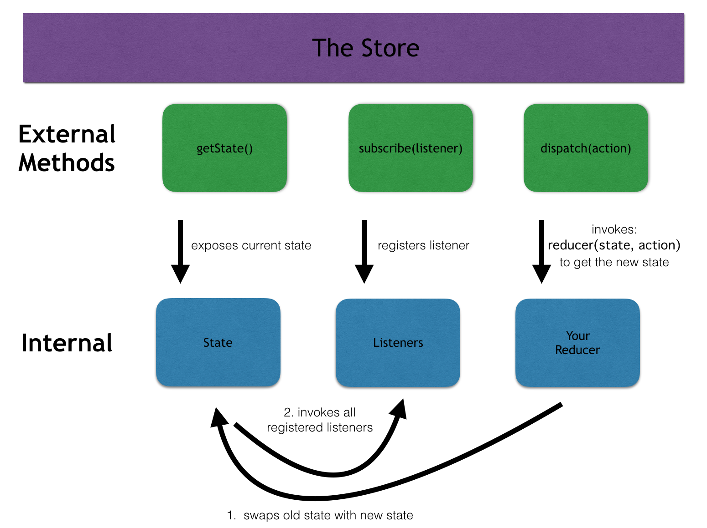

# StackChat

## Setting up

* `npm install` (or `yarn install`)
* `npm run seed`
* `npm start`

The `start` command will run both the `webpack` process (in watch mode) to build you client-side javascript files, and the Node process for your server with `nodemon`.
###Redux Architecture

###Demo

